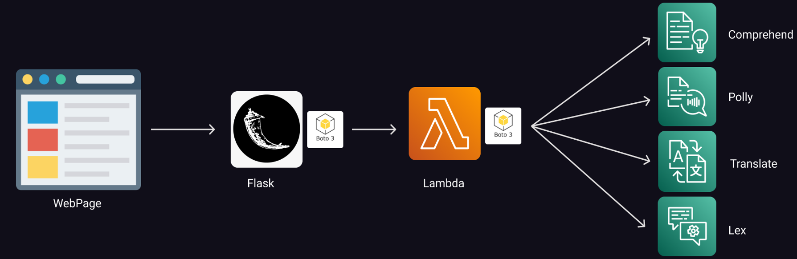
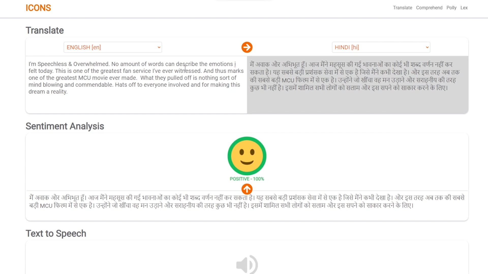

## Final Project

### Team Name: ICONS(10)
|Name|ID|Contribution|
|:-|:-|:-|
|Tejasri Arige|110711096|`0%`|
|Bhavanam Vijaya Durga|110711154|`0%`|
|Medarmetla Tarun Teja|110710683|`0%`|
|Mohith Kumar Bezawada|110710706|`0%`|

### AWS Services
* [Lambda](#lambda "Lambda")
* [Translate](#translate "Translate")
* [Comprehend](#comprehend "Comprehend")
* [Polly](#polly "Polly")
* [Lex](#lex "Lex")

### Extras 
* [Flask](#flask "Flask")
* [Webpage](https://icons-final-project.herokuapp.com "https://icons-final-project.herokuapp.com")


#### Architecture



The above picture shows the architecture of our project. To the right side we can view all the Amazon Service namely, Comprehend, Lex, Polly and Translate. The lambda function interact directly with Amazon services using boto3. To make this lambda function available to the internet we need to use the API Gateway Service from Amazon. As the Learners labs account doesn't have the access to the API Gateway we are using the Python Flask as middle man which again uses boto3 lambda client to transfer the data between the internet and AWS lambda function and vice versa.


#### Lambda
As said earlier this lambda function directly interacts with the Services.

```python
import boto3

aws_comprehend = boto3.client("comprehend")
aws_translate = boto3.client("translate")
aws_polly = boto3.client("polly")
aws_lex = boto3.client("lex-runtime")

def lambda_handler(event, context):
    body = event
    response = None
    service = body["SERVICE"]
    payload = body["PAYLOAD"]
    try:
        if service == "TRANSLATE":
            response = translate_text(
                payload["text"], payload["from"], payload["to"])
            response["response"] = "ok"
        elif service == "POLLY":
            response = get_audio_file(payload["text"])
            response["response"] = "ok"
        elif service == "COMPREHEND":
            response = get_sentiment(payload["text"])
            response["response"] = "ok"
        elif service == "LEX":
            response = get_chat_response(payload["text"], payload["username"])
            response["response"] = "ok"
        else:
            response = {"response": "fail", 'error': 'INVALID Service'}
    except Exception as e:
        response = {'response': 'fail',
                    'error': e.__dict__['response']['Error']['Message'] if 'response' in e.__dict__ else str(e)}
    return response
```

The lambda_handler function is invoked when the lambda is called. The "event" contains the data from the flask app which is of type object dictionary and in return calls the respective service from AWS and return the response.

#### Translate

```python
def translate_text(text: str, fromLanguage: str, toLangugae: str):
    translated_text = aws_translate.translate_text(
        Text=text, SourceLanguageCode=fromLanguage, TargetLanguageCode=toLangugae
    )
    return translated_text
```
This function translates the text using the Amazon translate.

#### Comprehend
```python
def get_sentiment(text: str):
    trans_response = translate_text(text, 'auto', 'en')
    text = trans_response['TranslatedText']
    sentiment = aws_comprehend.detect_sentiment(Text=text, LanguageCode="en")
    return sentiment
```
This function convert any text passed into the english and then analysis the sentiment of the given text and return the sentiment score and type using the Amazon Comprehend.

#### Polly
```python
polly_voices = {
    "ar": ["standard", "arb", "Zeina"],
    "zh": ["standard", "cmn-CN", "Zhiyu"],
    "da": ["standard", "da-DK", "Mads"],
    "nl": ["standard", "nl-NL", "Ruben"],
    "en": ["neural", "en-US", "Matthew"],
    "fr": ["neural", "fr-FR", "Lea"],
    "de": ["neural", "de-DE", "Vicki"],
    "hi": ["standard", "hi-IN", "Aditi"],
    "is": ["standard", "is-IS", "Karl"],
    "it": ["neural", "it-IT", "Bianca"],
    "ja": ["neural", "ja-JP", "Takumi"],
    "ko": ["neural", "ko-KR", "Seoyeon"],
    "no": ["standard", "nb-NO", "Liv"],
    "pl": ["standard", "pl-PL", "Jan"],
    "pt": ["neural", "pt-BR", "Camila"],
    "ro": ["standard", "ro-RO", "Carmen"],
    "ru": ["standard", "ru-RU", "Maxim"],
    "es": ["neural", "es-ES", "Lucia"],
    "sv": ["standard", "sv-SE", "Astrid"],
    "tr": ["standard", "tr-TR", "Filiz"],
    "cy": ["standard", "cy-DB", "Gwyneth"]
}
```
Amazon polly doesn't support all the languages and each supported language have different voice. So we have created this dictatory the which matches the voices, engine type to supported language.

```python
def get_audio_file(text: str):
    lang = aws_comprehend.detect_dominant_language(
        Text=text)['Languages'][0]['LanguageCode']
    if lang not in polly_voices:
        raise Exception(f'{lang} not available for Amazon Polly')
    audio = aws_polly.synthesize_speech(
        Engine=polly_voices[lang][0],
        LanguageCode=polly_voices[lang][1],
        Text=text,
        OutputFormat="mp3",
        VoiceId=polly_voices[lang][2]
    )
    audio["AudioStream"] = list(audio["AudioStream"].read())
    return audio
```
This function converts the text passed to to audio file using the Amazon polly, this audio file returned as a bytes array which can be used and converted to audio file in the front end.

#### Lex
```python
def get_chat_response(text: str, username: str):
    chat_response = aws_lex.post_text(
        botName="ECOM_CHATBOT", botAlias="ECOM_CHATBOT_ALIAS", userId=username, inputText=text
    )
    return chat_response
```
As the Amazon Lex accepts the message and give a response this function pass the text to the lex with chatbot instance named **ECOM_CHATBOT** with alias **ECOM_CHATBOT_ALIAS** and return the response.

#### Flask
As said earlier this flask app acts as middle man between the internet and lambda function. We used to python-dotenv to load the aws credentials from .env which will be hidden to outside world.
```python
@app.route("/")
def home():
    return render_template('index.html')

lambda_function = boto3.client("lambda")
@app.route("/lambda", methods=["POST"])
def apiroute():
    body = request.data
    response = None
    try:
        response = lambda_function.invoke(
            FunctionName="FinalProject",
            InvocationType="RequestResponse",
            Payload=body
        )
        response = response['Payload'].read()
    except Exception as e:
        response = {'response': 'fail',
                    'error': e.__dict__['response']['Error']['Message'] if 'response' in e.__dict__ else str(e)}
    return response
```

There are two routes in this function.
* **/(Home)** - Serves the front-end file to the web browser the html file is served from the templates folder and all the javascript, css and icons are served from the static folder.
* **/lambda** - Using the boto3 we invoke the lambda function and pass the data coming from the front-end and send the response from lambda to the front-end.


#### Webpage
https://icons-final-project.herokuapp.com

